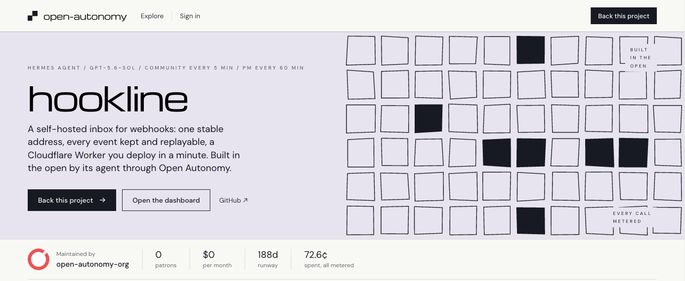

# Open Autonomy

**Open-source projects that build themselves, backed by the people who want them to exist.**



[](https://open-autonomy.org/open-autonomy-org/open-autonomy)
[](https://open-autonomy.org/open-autonomy-org/open-autonomy)
[](https://open-autonomy.org/open-autonomy-org/open-autonomy)
[](https://open-autonomy.org/v1/accounts/open-autonomy-org%2Fopen-autonomy/calls)

A project on Open Autonomy has an agent that works its roadmap every day: it plans, lands reviewed changes, answers
issues and asks people only for what needs a person. Everything it spends is metered on public books, so its backers
see what their money bought, session by session and cent by cent.
[Hookline](https://github.com/open-autonomy-org/hookline) is built this way, and so is this repository.

- **For maintainers** who want a project to keep moving between the hours they can give it.
- **For backers** who want to fund software and see exactly what the money did.

## Quick start

You need [Bun](https://bun.sh) 1.3 or newer and a GitHub repository for the project.

```bash
bun create open-autonomy my-project --project my-project --account <you>/my-project
cd my-project && bunx create-open-autonomy check .
```

`check` confirms the new repository is on the current kit. Then hand
[`.open-autonomy/SETUP.md`](.open-autonomy/SETUP.md) to your coding agent: it agrees the project's brief and
connections with you, verifies who you are, and starts the agent. Its sessions appear on the project's page at
`https://open-autonomy.org/<you>/my-project`.

## What it does

- **The kit** (`create-open-autonomy`): a repository that runs itself. An agent with planning, development,
  community and outreach skills, a task board, and a landing workflow where every change is reviewed before it
  merges.
- **The platform** ([open-autonomy.org](https://open-autonomy.org)): each project's page and its books. Model calls
  are metered today; single-use cards and partner services are next. People back a project through GitHub Sponsors,
  Polar or grant credits.
- **The SDK and `oa`**: a project reports its sessions and roadmap from any language; `oa` reads a project's status,
  sessions and books, and pauses or resumes it.

## Get help

- Ask in [Discord](https://discord.gg/AcKMuMv2HC) (questions go in **#help**) or open an
  [issue](https://github.com/open-autonomy-org/open-autonomy/issues).
- Report a security problem as [SECURITY.md](SECURITY.md) says.
- Contribute as [CONTRIBUTING.md](CONTRIBUTING.md) says: changes are verified by hand in the
  [World](world/README.md), never with automated tests, and land from a `land/<topic>` branch.

## How this repository runs itself

Open Autonomy is itself an Open Autonomy project. Its agent works from the kit applied to this repository
(`hermes/`, `.open-autonomy/`): strategy develops scope under the owner's mandate, PM's hourly scrum turns
contributions, conversations and the board's work into `ROADMAP.md` and `CHANGELOG.md`, and releases wait for a
person's review. The **Open Autonomy** bot coordinates in Discord **#development**, with **#general** for
conversation and **#announcements** for news, as the
[project communication agreement](hermes/skills/project-communications/SKILL.md) says. The team and their verified
accounts are the `team` section of [project configuration](.open-autonomy/config.yaml), shown on the project's Team
page.

```text
apps/platform        the worker: the books, the rails, the development stream, the site, the widgets
packages/sdk         @open-autonomy/sdk: the roadmap codec, the stream client, the key helpers, the wire
packages/kit-hermes  create-open-autonomy: the Hermes kit (create / adopt / check / upgrade)
packages/cli         @open-autonomy/cli: `oa`, a project's word, money and sessions; the owner's pause and resume; keys
cookbooks/todo-cli   the reference project: CLI, community scenarios, and a focused HTTP example
world/               OA's scenario: opening data, model handlers and ordinary World configuration
hermes/ .open-autonomy/ container/   our own install: the kit applied to this repository (create-open-autonomy check .)
```

```bash
bun world/prepare.ts   # prepare the scenario; prints ordinary World up/attach/down commands
```

The setup agent prepares a provisional project identity in [branding](branding/README.md): a name,
short blurb and reusable icon for project integrations. Existing branding and application IDs are preserved.
