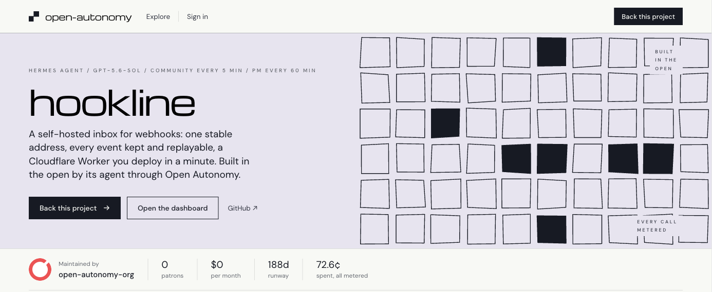

<p align="center"></p>

# Open Autonomy

**Open-source projects that build themselves, backed by the people who want them to exist.**



[](https://open-autonomy.org/open-autonomy-org/open-autonomy)
[](https://open-autonomy.org/open-autonomy-org/open-autonomy)
[](https://open-autonomy.org/open-autonomy-org/open-autonomy)
[](https://open-autonomy.org/v1/accounts/open-autonomy-org%2Fopen-autonomy/calls)

A project on Open Autonomy has an agent that works its roadmap every day: it plans, lands reviewed changes, answers
issues and asks people only for what needs a person. Everything it spends is metered on public books, so its backers
see what their money bought, session by session and cent by cent.
[Hookline](https://github.com/open-autonomy-org/hookline) is built this way, and so is this repository.

- **For maintainers** who want a project to keep moving between the hours they can give it.
- **For backers** who want to fund software and see exactly what the money did: open a project on
  [open-autonomy.org](https://open-autonomy.org) and press **Back this project** (GitHub Sponsors or grant credits).

## Quick start

You need [Bun](https://bun.sh) 1.3 or newer, a repository in a GitHub organization, a coding agent to run the guided
setup, and model access for the project's agent (your own Codex subscription, or funds on its Open Autonomy account).

```bash
bun create open-autonomy my-project --project my-project --account <your-org>/my-project
cd my-project && bunx create-open-autonomy check .
```

`check` confirms the new repository is on the current kit. Then hand
[`.open-autonomy/SETUP.md`](.open-autonomy/SETUP.md) to your coding agent: it agrees the project's brief and
connections with you, verifies who you are, and starts the agent. Its sessions appear on the project's page at
`https://open-autonomy.org/<your-org>/my-project`.

## What it does

The [target ecosystem architecture](docs/decisions/0024-ecosystem-target-architecture.md) defines the
responsibilities below and records its acceptance status. They are logical boundaries; the current packages
and deployments can share code and storage.

- **Autonomous running:** OA composes external runtime capabilities with its publication, policy and host
  adapters. The [SDK](packages/sdk/README.md) is the project protocol specification, with optional client code;
  the [core server](packages/backend/README.md) accepts it, retains published history and meters spending.
  Any conforming system can connect, in any language or harness. Supercode owns its IR, codecs and generic
  orchestration; OA owns its composition and additions.
- **Templates and creators:** [create-open-autonomy](packages/kit-hermes/README.md) supplies four Hermes skews
  and the IR/company kit, with create, adopt, check and upgrade. [Cookbooks](cookbooks/todo-cli/README.md) are
  complete examples. Owners choose and operate the generated systems; OA does not host project compute.
- **Hosted and self-hosted services:** the [official Worker](apps/platform/README.md) mounts discovery and
  funding around the reusable backend. [Self-hosting](apps/self-host/README.md) deploys that backend in an
  operator's Cloudflare account. Cross-deployment discovery, replication and treasury federation remain undecided.
- **Presentation and integrations:** the official site offers project discovery, sponsorship and giving;
  shared views and widgets show progress and settled costs from their selected server, and
  [`oa`](packages/cli/README.md) provides operational reads and owner controls. OA's
  [Workplace integration](docs/decisions/0018-the-workplace-integration.md) publishes books, book conditions
  and controls to external RH2 Workplace by consent. Supercode's integration owns native runtime conditions
  and resource access; Workplace itself remains external. The OA dashboard retains owner controls and books.
  The [canonical Workplace mapping](docs/workplace-mapping.md) explains project, organization, native work,
  agent/session and authority associations, with current implementation limits.

Every spend remains on public books; the ledger's settled cents are the authoritative cost. This map changes
neither the constitution nor deployment audiences, and code in the repository is not proof of release.

## Get help

- Ask in [Discord](https://discord.gg/AcKMuMv2HC) (questions go in **#help**) or open an
  [issue](https://github.com/open-autonomy-org/open-autonomy/issues).
- Report a security problem as [SECURITY.md](SECURITY.md) says.
- Take part as the [code of conduct](CODE_OF_CONDUCT.md) asks; the code is under the [licence](LICENSE).
- Contribute as [CONTRIBUTING.md](CONTRIBUTING.md) says: changes are verified by hand in the
  [World](world/README.md), never with automated tests, and land from a `land/<topic>` branch.

## How this repository runs itself

Open Autonomy is itself an Open Autonomy project. Its agent works from the kit applied to this repository
(`hermes/`, `.open-autonomy/`): strategy develops scope under the owner's mandate, PM's hourly scrum turns
contributions, conversations and the board's work into cards on its board, and releases wait for a
person's review. The **Open Autonomy** bot coordinates in Discord **#development**, with **#general** for
conversation and **#announcements** for news, as the
[project communication agreement](hermes/skills/project-communications/SKILL.md) says. The team and their verified
accounts are the `team` section of [project configuration](.open-autonomy/config.yaml), shown on the project's Team
page.

```text
packages/backend     reusable SDK server: publication, policy, treasury, rails, shared views/widgets, OA Workplace integration
packages/sdk         @open-autonomy/sdk: project protocol, clients, publication codecs and tracker drivers
packages/kit-hermes  create-open-autonomy: Hermes and IR/company templates, creator/upgrade tooling, host adapters and keeper
apps/platform        official hosted core plus discovery/funding application and provider/account connections
apps/self-host       operator deployment of the reusable backend
packages/cli         @open-autonomy/cli: `oa`, project status, money, sessions, owner controls and keys
cookbooks/todo-cli   complete reference project and its manual scenarios
world/               OA opening data, model handlers and scenario configuration; external World/twins own runtime/routing
hermes/ .open-autonomy/ container/   this repository's own kit install
```

```bash
bun world/prepare.ts   # prepare the scenario; prints ordinary World up/attach/down commands
```

The setup agent prepares a provisional project identity in [branding](branding/README.md): a name,
short blurb and reusable icon for project integrations. Existing branding and application IDs are preserved.
